# HURAVA V1 — Rapport de build CAO

**HURAVA by ARCHIACCESS** · *Built to Move.* · Bâtir. Organiser. Avancer.

> Modèle paramétrique préliminaire. Les valeurs marquées **PROVISOIRE — À VALIDER** ne sont pas figées. Aucune simulation n'a été réalisée dans ce build ; le modèle n'est ni calculé ni certifié.

## 1. Livrables

| # | Livrable | Fichier |
|---|---|---|
| 1 | HURAVA_MASTER_ASSEMBLY | `out/step/HURAVA_MASTER_ASSEMBLY.step` (assemblage STEP AP214, 26 composants) |
| 2 | Modèle paramétrique complet | `params.py` → `skeleton.py` → `components.py` → `build.py` |
| 3 | Structure organisée | composants `00_MASTER_SKELETON` … `25_LOGO` (arbre STEP + `out/step/groups/`) |
| 4 | Nomenclature initiale | `out/bom/BOM_HURAVA_V1.csv` |
| 5 | Liste des paramètres | `out/bom/PARAMETRES_HURAVA_V1.csv` + §3 |
| 6 | Liste des pièces | `out/bom/PIECES_HURAVA_V1.csv` (1 ligne par corps : id, nom, matériau, qté, fonction) |
| 7 | Composants achetés | `out/bom/ACHATS_HURAVA_V1.csv` + §6 |
| 8 | Soudures principales | `out/bom/SOUDURES_HURAVA_V1.csv` + §7 |
| 9 | Masse estimative | §5 |
| 10 | Points à valider | §9 |
| 11 | Vues avant / arrière / gauche / droite / dessus / dessous / iso / éclatée | `out/views/*.png` |
| 12 | Visualisation 3D | `out/glb/hurava_v1_closed.glb` |

## 2. Validation automatique (phase 14)

Build : 198 corps, 20 contrôles — **20 / 20 validés**. Chaque phase 1 → 13 a été validée (géométrie valide, aucune collision, emprise, contrôles propres à la phase) avant de passer à la suivante — voir `out/report/BUILD_LOG.md`.

| Contrôle | Intitulé | Résultat | Détail |
|---|---|---|---|
| CHECK 01 | Dimensions principales 2200 × 1100 × 1500 | ✅ | enveloppe de caisse 2200.0 × 1100.0 × 1500.0 mm (Z 330→1830) |
| CHECK 02 | 2 portes sur la face avant 2200 | ✅ | 2 vantaux, plan Y = 0…2 |
| CHECK 03 | 2 barres sur les faces latérales 1100 | ✅ | 14-BAR: X -91.8…-58.1; 15-BAR: X 2258.2…2291.8 |
| CHECK 04 | Barres Ø33,7 × 4 × 900 | ✅ | volume 335899 mm³ / théorique 335899 mm³ |
| CHECK 05 | 4 roues | ✅ | 4 roulettes Ø200 |
| CHECK 06 | 2 fourreaux sous le châssis | ✅ | entraxe 900 mm, Z 250…330 |
| CHECK 07 | 4 points de levage au-dessus | ✅ | Z max 1910 mm |
| CHECK 08 | Attelage sur les faces latérales 1100 | ✅ | G : X -135…-13, axe Y 550 ; D : X 2213…2335, axe Y 550 ; aucun crochet en face arrière |
| CHECK 09 | Crochet vers le haut + anneau articulé | ✅ | bec +55 mm — G : libre au repos ✅ OK, traction 40 mm bloquée ✅ OK, soulevé 30 mm retenu ✅ OK, dégagé seulement au-dessus du bec ✅ OK | D : libre au repos ✅ OK, traction 40 mm bloquée ✅ OK, soulevé 30 mm retenu ✅ OK, dégagé seulement au-dessus du bec ✅ OK |
| CHECK 10 | 2 racks internes | ✅ | 19 + 19 corps |
| CHECK 11 | 3 niveaux par rack | ✅ | niveaux [3, 3] |
| CHECK 12 | Passage central libre | ✅ | largeur libre 1216 mm × hauteur 1434 mm [] |
| CHECK 13 | Aucun moteur / électronique / hydraulique | ✅ | aucun composant motorisé, électrique ou hydraulique |
| CHECK 14 | Aucune barre sur la face avant | ✅ | barres et supports compris dans Y 0…1100, hors faces avant/arrière |
| CHECK 15 | Aucun attelage à boule | ✅ | aucune surface sphérique dans 22/23 |
| CHECK 16 | Aucune troisième porte | ✅ |  |
| CHECK 17 | Symétrie gauche / droite | ✅ | Racks ✅ OK; Barres ✅ OK; Fourreaux ✅ OK; Levage AV ✅ OK; Levage AR ✅ OK; Attelage ✅ OK |
| CHECK 18 | Absence d'interférences | ✅ | 198 corps, 0 interférence(s) [] (1 s) |
| CHECK 19 | Portes ouvrables 0 → 90° | ✅ | balayage 0°, 15°, 30°, 45°, 60°, 75°, 85°, 90° sans collision ✅ OK ; jeu butée à 90° = 0.50 mm ; dépassement 92° bloqué par la butée ✅ OK |
| CHECK 20 | Modèle assemblable | ✅ | 198 corps valides ✅ OK ; chaque corps soudé, boulonné ou guidé (jeu ≤ 1 mm) sur un autre ; corps isolés : aucun |

## 3. Paramètres

| Paramètre | Valeur | Unité | Statut | Note |
|---|---|---|---|---|
| `HURAVA_LENGTH` | 2200.0 | mm | FIGÉ | X, faces avant/arrière |
| `HURAVA_WIDTH` | 1100.0 | mm | FIGÉ | Y, faces latérales |
| `HURAVA_BODY_HEIGHT` | 1500.0 | mm | FIGÉ | hauteur de caisse, du dessus châssis au dessus toit |
| `CHASSIS_HEIGHT` | 330.0 | mm | SPEC ≈ | Z du dessus châssis / dessous plancher |
| `GROUND_CLEARANCE` | 250.0 | mm | SPEC ≈ | Z du point structurel le plus bas (dessous fourreaux) |
| `MAIN_PROFILE_H` | 60.0 | mm | FIGÉ | tube 60×40×3 S235JR — grande dimension |
| `MAIN_PROFILE_W` | 40.0 | mm | FIGÉ | tube 60×40×3 S235JR — petite dimension |
| `MAIN_PROFILE_T` | 3.0 | mm | FIGÉ | tube 60×40×3 S235JR — épaisseur |
| `SEC_PROFILE` | 40.0 | mm | FIGÉ | tube 40×40×3 S235JR |
| `SEC_PROFILE_T` | 3.0 | mm | FIGÉ |  |
| `LOCAL_PROFILE` | 30.0 | mm | FIGÉ | tube 30×30×2 S235JR (racks) |
| `LOCAL_PROFILE_T` | 2.0 | mm | FIGÉ |  |
| `GUSSET_SIZE` | 100.0 | mm | FIGÉ | gousset 100×100×5 |
| `GUSSET_T` | 5.0 | mm | FIGÉ |  |
| `PANEL_T` | 2.0 | mm | **PROVISOIRE — À VALIDER** | tôle parois latérales et arrière |
| `ROOF_T` | 2.0 | mm | **PROVISOIRE — À VALIDER** | tôle de toit |
| `FLOOR_T` | 4.0 | mm | **PROVISOIRE — À VALIDER** | tôle de plancher structurelle (larmée 4/6 envisageable) |
| `DOOR_SKIN_T` | 2.0 | mm | **PROVISOIRE — À VALIDER** | tôle de parement des vantaux |
| `CHASSIS_CROSS_X` | (290.0, 1100.0, 1910.0) | mm | **PROVISOIRE — À VALIDER** | axes X des traverses intermédiaires de châssis (portée plancher ≤ 330) |
| `ROOF_BOW_X` | (733.0, 1467.0) | mm | **PROVISOIRE — À VALIDER** | axes X des traverses de toit 40×40 |
| `SIDE_RAIL_Z` | 1000.0 | mm | **PROVISOIRE — À VALIDER** | axe Z de la lisse latérale 40×40 (reprise des barres) |
| `REAR_RAIL_Z` | 1000.0 | mm | **PROVISOIRE — À VALIDER** | axe Z de la lisse arrière 40×40 |
| `REAR_MID_POST_X` | 1100.0 | mm | **PROVISOIRE — À VALIDER** | axe X du montant arrière intermédiaire 40×40 |
| `DOOR_COUNT` | 2 | u | FIGÉ | vantaux sur la face avant |
| `HINGES_PER_DOOR` | 3 | u | FIGÉ |  |
| `HINGE_PIN_D` | 16.0 | mm | FIGÉ | axe de charnière ≈ Ø16 |
| `DOOR_OPEN_MAX` | 90.0 | ° | FIGÉ | ouverture 0 → 90° avec butée positive |
| `LOCK_ROD_D` | 14.0 | mm | FIGÉ | tringles haute et basse Ø14 |
| `DOOR_GAP_SIDE` | 5.0 | mm | **PROVISOIRE — À VALIDER** | jeu vantail / montant |
| `DOOR_GAP_CENTER` | 6.0 | mm | **PROVISOIRE — À VALIDER** | jeu entre vantaux |
| `DOOR_GAP_BOTTOM` | 6.0 | mm | **PROVISOIRE — À VALIDER** | jeu vantail / plancher |
| `DOOR_GAP_TOP` | 5.0 | mm | **PROVISOIRE — À VALIDER** | jeu vantail / traverse haute |
| `HINGE_AXIS_X` | 30.0 | mm | **PROVISOIRE — À VALIDER** | position X de l'axe de charnière depuis le bord d'enveloppe |
| `HINGE_AXIS_Y` | -20.0 | mm | **PROVISOIRE — À VALIDER** | position Y de l'axe (devant la face avant) |
| `HINGE_KNUCKLE_OD` | 30.0 | mm | **PROVISOIRE — À VALIDER** | nœud de charnière Ø30, alésage Ø17 |
| `HINGE_KNUCKLE_LEN` | 55.0 | mm | **PROVISOIRE — À VALIDER** | longueur d'un nœud |
| `HINGE_Z_MARGIN` | 150.0 | mm | **PROVISOIRE — À VALIDER** | charnières haute/basse à 150 des bords du vantail |
| `DOOR_STOP_Z` | 0.75 |  | **PROVISOIRE — À VALIDER** | position relative de la butée 90° sur la hauteur du vantail |
| `HANDLING_BAR_DIAMETER` | 33.7 | mm | FIGÉ |  |
| `HANDLING_BAR_THICKNESS` | 4.0 | mm | FIGÉ |  |
| `HANDLING_BAR_LENGTH` | 900.0 | mm | FIGÉ |  |
| `HANDLING_BAR_COUNT` | 2 | u | FIGÉ | une par face latérale |
| `HANDLING_BAR_Z` | 1000.0 | mm | **PROVISOIRE — À VALIDER** | hauteur d'axe (ergonomie 900–1100) |
| `HANDLING_BAR_STANDOFF` | 75.0 | mm | **PROVISOIRE — À VALIDER** | axe de barre / face extérieure du panneau (passage de main ≈ 58) |
| `HANDLING_BAR_SUPPORT_PITCH` | 760.0 | mm | **PROVISOIRE — À VALIDER** | entraxe des 2 supports |
| `HANDLING_BAR_SUPPORT` | (10.0, 60.0) | mm | **PROVISOIRE — À VALIDER** | plat support ép. × hauteur |
| `RACK_COUNT` | 2 | u | FIGÉ | gauche et droit |
| `RACK_LEVELS` | 3 | u | FIGÉ | niveaux par rack |
| `RACK_DEPTH` | 450.0 | mm | **PROVISOIRE — À VALIDER** | profondeur de rack selon X |
| `RACK_Y_RANGE` | (70.0, 1030.0) | mm | **PROVISOIRE — À VALIDER** | emprise Y du rack |
| `RACK_SHELF_Z` | (700.0, 1100.0, 1500.0) | mm | **PROVISOIRE — À VALIDER** | Z du dessus des 3 tablettes |
| `RACK_SHELF_T` | 2.0 | mm | **PROVISOIRE — À VALIDER** | tôle de tablette |
| `WHEEL_COUNT` | 4 | u | FIGÉ |  |
| `CASTER_D` | 200.0 | mm | **PROVISOIRE — À VALIDER** | roue Ø200, bandage caoutchouc plein sur jante acier |
| `CASTER_W` | 50.0 | mm | **PROVISOIRE — À VALIDER** | largeur de bandage |
| `CASTER_H` | 245.0 | mm | **PROVISOIRE — À VALIDER** | hauteur hors tout roulette (catalogue) |
| `CASTER_OFFSET` | 55.0 | mm | **PROVISOIRE — À VALIDER** | déport de chape pivotante |
| `CASTER_PLATE` | (140.0, 110.0, 8.0) | mm | **PROVISOIRE — À VALIDER** | platine de roulette L×l×ép. |
| `CASTER_BOLT_PITCH` | (110.0, 80.0) | mm | **PROVISOIRE — À VALIDER** | entraxe perçages platine (4×M12) |
| `CASTER_AXIS_INSET` | 165.0 | mm | **PROVISOIRE — À VALIDER** | axe de pivot à 165 des bords (balayage dans l'enveloppe) |
| `CASTER_CMU` | 500.0 | kg | **PROVISOIRE — À VALIDER** | charge admissible par roue |
| `CASTER_MASS` | 9.5 | kg | **PROVISOIRE — À VALIDER** | masse catalogue d'une roulette |
| `WHEEL_SUPPORT_PLATE_T` | 10.0 | mm | **PROVISOIRE — À VALIDER** | platine porte-roue soudée sous châssis |
| `WHEEL_SPACER_T` | 15.0 | mm | **PROVISOIRE — À VALIDER** | cale soudée (rattrapage hauteur roulette) |
| `FORK_POCKET_COUNT` | 2 | u | FIGÉ |  |
| `FORK_POCKET_PITCH` | 900.0 | mm | **PROVISOIRE — À VALIDER** | entraxe — à confirmer selon engins ciblés (pas une norme) |
| `FORK_POCKET_W` | 230.0 | mm | **PROVISOIRE — À VALIDER** | largeur extérieure (intérieur 220) |
| `FORK_POCKET_H` | 80.0 | mm | **PROVISOIRE — À VALIDER** | hauteur extérieure (intérieur 70) |
| `FORK_POCKET_T` | 5.0 | mm | **PROVISOIRE — À VALIDER** | épaisseur (tube 230×80×5 ou tôle pliée) |
| `LIFTING_POINT_COUNT` | 4 | u | FIGÉ |  |
| `LUG_T` | 15.0 | mm | **PROVISOIRE — À VALIDER** | oreille de levage épaisseur |
| `LUG_W` | 80.0 | mm | **PROVISOIRE — À VALIDER** | oreille largeur |
| `LUG_HOLE_D` | 32.0 | mm | **PROVISOIRE — À VALIDER** | perçage manille |
| `LUG_HOLE_Z` | 30.0 | mm | **PROVISOIRE — À VALIDER** | axe du perçage au-dessus de la platine |
| `LUG_BASE` | (80.0, 12.0) | mm | **PROVISOIRE — À VALIDER** | platine d'oreille carré × ép. |
| `ROOF_NOTCH` | 86.0 | mm | **PROVISOIRE — À VALIDER** | dégagement de toit aux angles |
| `HITCH_SIDES` | ('G', 'D') |  | **PROVISOIRE — À VALIDER** | attelage sur les faces latérales 1100 (décision utilisateur) — un crochet de chaque côté ; ('D',) pour un seul |
| `HOOK_T` | 25.0 | mm | **PROVISOIRE — À VALIDER** | crochet oxycoupé ép. 25 (pièce forgée à étudier) |
| `HOOK_THROAT_Z` | 300.0 | mm | **PROVISOIRE — À VALIDER** | Z du fond de gorge (hauteur d'attelage à confirmer) |
| `HOOK_THROAT_W` | 60.0 | mm | **PROVISOIRE — À VALIDER** | largeur de gorge |
| `HOOK_TIP_H` | 55.0 | mm | **PROVISOIRE — À VALIDER** | hauteur du bec au-dessus du fond de gorge |
| `HOOK_TIP_W` | 32.0 | mm | **PROVISOIRE — À VALIDER** | épaisseur du bec selon Y |
| `RING_R` | 47.0 | mm | **PROVISOIRE — À VALIDER** | anneau : rayon moyen (Ø int. 70) |
| `RING_r` | 12.0 | mm | **PROVISOIRE — À VALIDER** | anneau : rayon de section (Ø24) |
| `RING_PIN_D` | 20.0 | mm | **PROVISOIRE — À VALIDER** | axe d'articulation de l'anneau côté engin |
| `PAYLOAD_NOMINAL` | 500.0 | kg | FIGÉ |  |
| `PAYLOAD_DESIGN` | 750.0 | kg | FIGÉ |  |
| `DYNAMIC_FACTOR` | 1.5 |  | FIGÉ |  |
| `SAFETY_FACTOR_MIN` | 1.5 |  | FIGÉ | cible préliminaire — pas une certification |
| `STEEL_DENSITY` | 7.85e-06 | kg/mm³ | FIGÉ | S235JR |

## 4. Encombrements

| Référence | Valeur |
|---|---|
| Enveloppe principale de caisse (CHECK 01) | 2200 × 1100 × 1500 mm, de Z 330 à Z 1830 |
| Hors tout avec crochets d'attelage latéraux (X) | 2470 mm (barres seules : 2384 mm) |
| Hors tout avec charnières et butées (Y) | 1161 mm |
| Hors tout avec oreilles de levage (Z) | 1910 mm |
| Garde au sol (dessous fourreaux) | 250 mm |
| Passage central entre racks | 1216 mm |

## 5. Masse estimative

- Masse à vide calculée (volumes B-rep × 7850 kg/m³, masses catalogue pour les achats) : **678 kg**
- Centre de gravité à vide : X 1100 · Y 519 · Z 857 mm
- Masse en charge de dimensionnement (750 kg) : **1428 kg** ; avec facteur dynamique 1,5 : 2142 kg

| Composant | Masse (kg) |
|---|---|
| 01_CHASSIS | 94.6 |
| 02_SECONDARY_STRUCTURE | 26.9 |
| 03_FLOOR | 75.3 |
| 04_ROOF | 37.5 |
| 05_SIDE_PANELS | 51.7 |
| 06_REAR_PANEL | 51.6 |
| 07_FRONT_DOORS | 87.0 |
| 08_DOOR_HINGES | 7.3 |
| 09_LOCKING_SYSTEM | 9.5 |
| 10_RACK_LEFT | 44.3 |
| 11_RACK_RIGHT | 44.3 |
| 13_WHEEL_SUPPORTS | 39.6 |
| 12_WHEELS | 38.0 |
| 24_FASTENERS_HARDWARE | 1.2 |
| 14_HANDLING_BAR_LEFT | 3.3 |
| 15_HANDLING_BAR_RIGHT | 3.3 |
| 16_FORK_POCKET_LEFT | 26.7 |
| 17_FORK_POCKET_RIGHT | 26.7 |
| 18_LIFTING_POINT_FL | 1.1 |
| 19_LIFTING_POINT_FR | 1.1 |
| 20_LIFTING_POINT_RL | 1.1 |
| 21_LIFTING_POINT_RR | 1.1 |
| 22_HITCH_HOOK | 4.7 |
| 25_LOGO | 0.1 |

## 6. Composants achetés

| Désignation | Section / référence | Qté | Masse totale (kg) | Statut |
|---|---|---|---|---|
| Axe de charnière Ø16 | Ø16 × 118 | 6 | 1.18 | PROVISOIRE (matière) |
| Boîtier de crémone-serrure | Crémone 3 points à cylindre | 1 | 2.20 | PROVISOIRE (référence) |
| Poignée palette extérieure cadenassable | Poignée palette + rosace | 1 | 1.10 | PROVISOIRE (référence) |
| Roulette pivotante Ø200 à frein total + blocage directionnel | Ø200×50 H245 CMU 500 kg | 2 | 19.00 | PROVISOIRE (référence catalogue) |
| Vis H M12×50 cl. 8.8 + écrou frein + rondelle | M12×50 | 16 | 1.20 |  |
| Roulette pivotante Ø200 à blocage directionnel | Ø200×50 H245 CMU 500 kg | 2 | 19.00 | PROVISOIRE (référence catalogue) |
| Marquage HURAVA by ARCHIACCESS — face arrière | Film adhésif découpé | 1 | 0.05 |  |
| Marquage HURAVA — vantail gauche | Film adhésif découpé | 1 | 0.02 |  |

Débit des profilés (barres de 6 m, +10 % de chutes) :

| Section | Longueur totale (m) | Barres de 6 m (≈, +10 % chutes) |
|---|---|---|
| Rond Ø14 | 2.60 | 1 |
| Tube carré 30×30×2 | 27.43 | 6 |
| Tube carré 40×40×3 | 19.01 | 4 |
| Tube rect. 230×80×5 | 2.20 | 1 |
| Tube rect. 60×40×3 | 21.18 | 4 |
| Tube rond Ø33.7×4.0 | 1.80 | 1 |

## 7. Soudures principales

Procédé envisagé : MAG 135, gorges indicatives a3 à a8 — **PROVISOIRE — À VALIDER** par note de calcul et DMOS.

| Type de soudure | Nb de joints | Longueur cumulée indicative (m) |
|---|---|---|
| bouchons Ø8 pas 150 + cordon périphérique | 4 | 24.4 |
| angle a3 cadre ; bouchons Ø8 pas 150 parement | 2 | 23.0 |
| angle a3 discontinue 50/150 | 1 | 9.9 |
| angle a4 3 côtés | 20 | 6.9 |
| angle a3 | 18 | 4.6 |
| angle a4 périphérique | 18 | 4.6 |
| angle a4 discontinue 50/100 ×2 | 2 | 4.4 |
| angle a2,5 | 2 | 2.9 |
| angle a3 périphérique | 14 | 2.8 |
| angle a3 ×2 extrémités | 7 | 2.2 |
| angle a4 périphérique ×2 faces | 4 | 1.6 |
| bouchons Ø8 pas 150 | 1 | 1.4 |
| angle a5 périphérique | 4 | 1.3 |
| angle a4 périphérique ×2 extrémités | 2 | 0.8 |
| angle a6 périphérique | 2 | 0.8 |
| angle a6 double (pleine pénétration à étudier) | 4 | 0.8 |
| angle a4 périphérique (gueule de loup) | 4 | 0.6 |
| angle a8 double + chanfrein (pleine pénétration à étudier) | 2 | 0.4 |

Joints critiques (chemin de charge) : oreilles de levage / platines / montants ; crochet / platine / longeron arrière ; fourreaux / longerons (traversée) ; platines porte-roues / châssis ; supports de barres / lisses.

## 8. Contrôles préliminaires (ordres de grandeur — pas une note de calcul)

| Élément | Hypothèse | Valeur | Commentaire |
|---|---|---|---|
| Roulette | 3 appuis sur 4, charge statique | 476 kg / roue | 95 % de la CMU 500 kg |
| Roulette | idem × facteur dynamique 1,5 | 714 kg / roue | **dépasse la CMU 500 kg → prévoir roulettes CMU ≥ 750 kg** |
| Oreille de levage | élingue 4 brins, 3 brins porteurs, 60°, × 1,5 | 824 kg / oreille | manille et oreille CMU ≥ 1 t minimum ; oreille ép. 15 à vérifier (arrachement, pression diamétrale, soudure) |
| Attelage | roulement chantier 10 % + rampe 10 %, × 1,5 | 4.2 kN | effort horizontal (selon X) sur crochet latéral, traverse d'extrémité et longeron d'attelage |
| Facteur de sécurité | cible ≥ 1.5 | non évalué | simulation SimScale à réaliser (§10) |

## 9. Points nécessitant validation

1. **Hauteur** — Le cahier des charges donne 1500 mm d'enveloppe et un dessus de caisse à Z ≈ 1830. Le modèle place la caisse de Z 330 à Z 1830 (1500 mm de caisse posée sur le châssis). Hauteur hors tout 1910 mm avec les oreilles. La visualisation 5D précédente avait 1500 mm hors tout : **l'interprétation retenue ici est à confirmer.**
2. **Portes** — « 2 portes à deux vantaux » interprété comme **une porte double de 2 vantaux** (DOOR_COUNT = 2, 3 charnières par vantail). Vantail gauche semi-fixe (verrous haut/bas), vantail droit actif (crémone 3 points, poignée cadenassable, couvre-joint anti-arrachement).
3. **Roues** — Architecture PROVISOIRE : 4 roulettes pivotantes Ø200, toutes à blocage directionnel (marche en ligne selon X pour la traction), 2 avec frein total côté portes. **CMU 500 kg insuffisante avec le facteur dynamique** (714 kg/roue) → choisir une référence ≥ 750 kg de même hauteur (245 mm) ou reprendre la cale.
4. **Masse** — Tare calculée 678 kg, élevée par rapport à la charge utile. Leviers : tôles 1,5 mm, cadres de vantaux 30×30, racks, plancher 3 mm raidi.
5. **Fourreaux** — Entraxe 900 et section intérieure 220 × 70 **à confirmer selon les engins ciblés** (pas une norme). Fourreaux traversants : les longerons AV/AR sont interrompus et soudés sur les flancs des fourreaux.
6. **Attelage** — **Déplacé sur les faces latérales de 1100 mm (décision du 26/09)** au lieu de la face arrière du cahier des charges §11 : un crochet de chaque côté (paramètre HITCH_SIDES), à Y 550, sous la barre de manutention ; traction selon la longueur, reprise par un longeron d'attelage 60×40 jusqu'à la 1re traverse intermédiaire. Hors tout avec crochets 2470 mm. Un seul côté suffit-il ? Crochet oxycoupé ép. 25 en S235 : nuance S355 ou pièce forgée à étudier. Hauteur de gorge Z 300 à caler sur les engins tracteurs. Retenue de l'anneau par la seule géométrie (bec de 55 mm, pas de ressort) : ajouter ou non une goupille de sécurité est **une décision à prendre**. L'anneau articulé, la chape et le timon sont côté engin, hors nomenclature HURAVA.
7. **Levage** — Oreilles orientées vers le centre de gravité, décalées d'environ 20 mm de l'axe des montants : à recentrer après calcul. CMU à calculer.
8. **Galvanisation** — Trous d'évent et d'écoulement (Ø10–12 à chaque extrémité de profil creux) **non modélisés**. Tôles de 2 mm soudées sur cadre : risque de déformation dans le bain ; alternative : tôles pré-galvanisées rivetées après galvanisation de l'ossature. Compatibilité du bain (≈ 2,4 × 1,3 × 1,95 m) à vérifier avec le galvaniseur.
9. **Butée à 90°** — Bloc soudé sur le montant avant, jeu 0,5 mm pour un tampon élastomère. Saillie de 60 mm devant la face avant : à arrondir, ou remplacer par un arrêt de porte.
10. **Barres de manutention** — Axe à Z 1000 et à 75 mm du panneau (passage de main 58 mm). Extrémités ouvertes : bouchons à décider (utiles aussi pour l'écoulement du zinc).
11. **Racks** — Profondeur 450, tablettes à Z 700 / 1100 / 1500, tôle 2 mm : charge par niveau à définir. Rack soudé au plancher, à la lisse latérale et au cadre haut.
12. **Épaisseurs** — Tôles 2 mm (parois, toit, vantaux) et plancher 4 mm : PROVISOIRE.
13. **Profilés** — Tubes modélisés à angles vifs (sans les rayons EN 10219) : correct pour la simulation poutre/coque, à affiner pour les plans.
14. **Étanchéité** — Joints de portes, recouvrements et gouttière non modélisés.
15. **Soudures** — Gorges et longueurs indicatives, à valider (note de calcul, DMOS, qualification soudeurs).

## 10. Préparation à la simulation (SimScale)

- Import : `out/step/HURAVA_MASTER_ASSEMBLY.step` ou les fichiers par composant (`out/step/groups/`). Corps solides propres, sans auto-intersection ; contacts soudés = faces coïncidentes (tolérance 0).
- Appuis : faces inférieures des 4 platines porte-roues `13-PLA-*` (ou contact sol des roues `12-ROU-*`).
- Charge utile : pression sur la face supérieure de `03-PLA` et des tablettes `10/11-*-TB`.
- Levage : alésages Ø32 des oreilles `18…21-ORE`. Fourches : faces intérieures basses des fourreaux `16/17-FOU`.
- Traction : flanc intérieur du bec des crochets latéraux `22-CRO-G` / `22-CRO-D` (effort selon X).
- Pièces à exclure : 23 (interface engin), 24 (boulonnerie), 25 (marquage).

## 11. Vues

### Vue avant

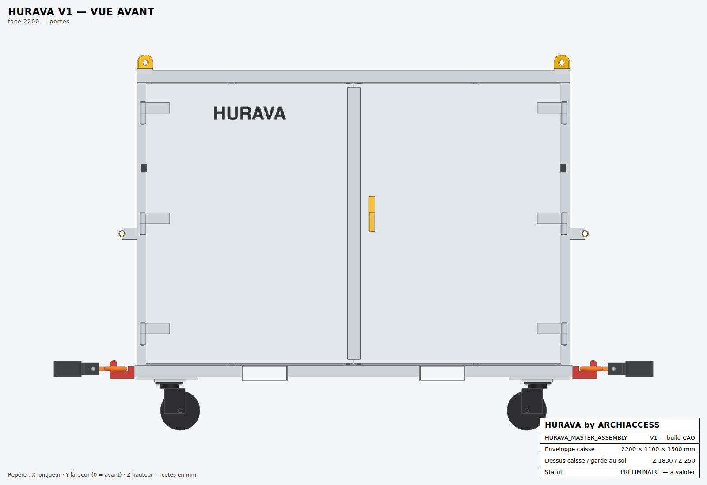

### Vue arrière

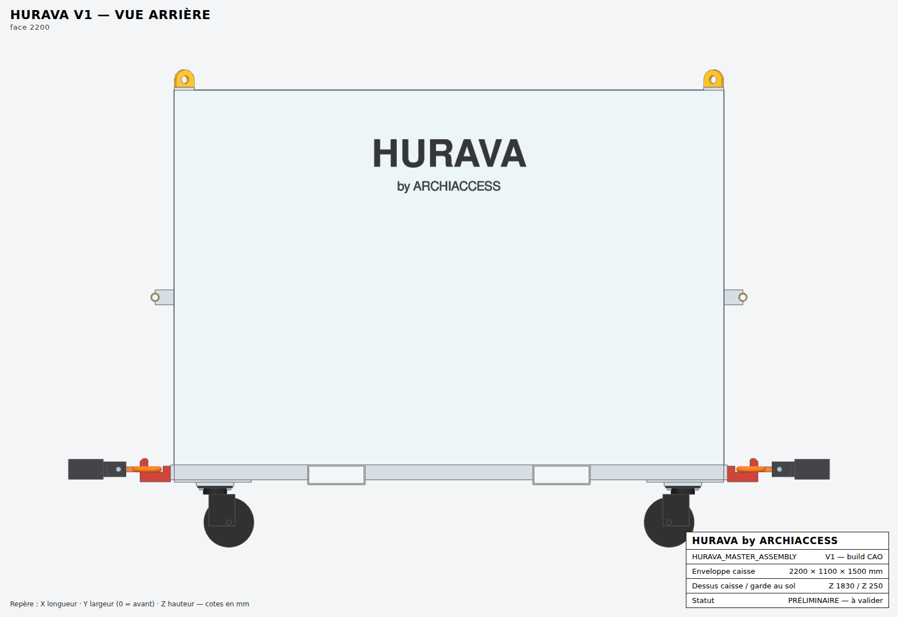

### Vue latérale gauche

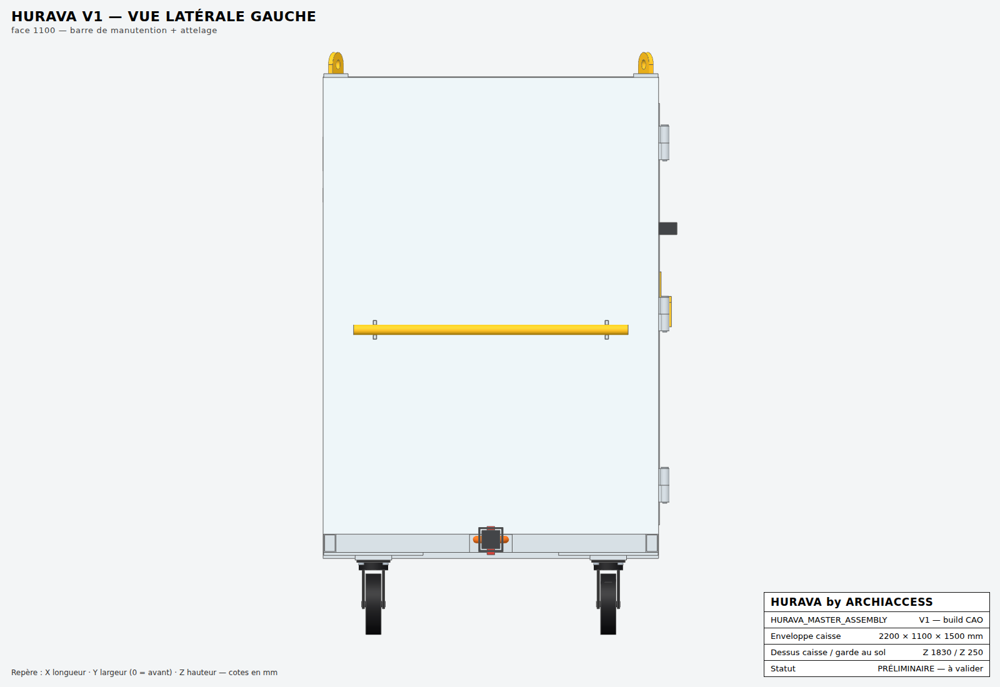

### Vue latérale droite

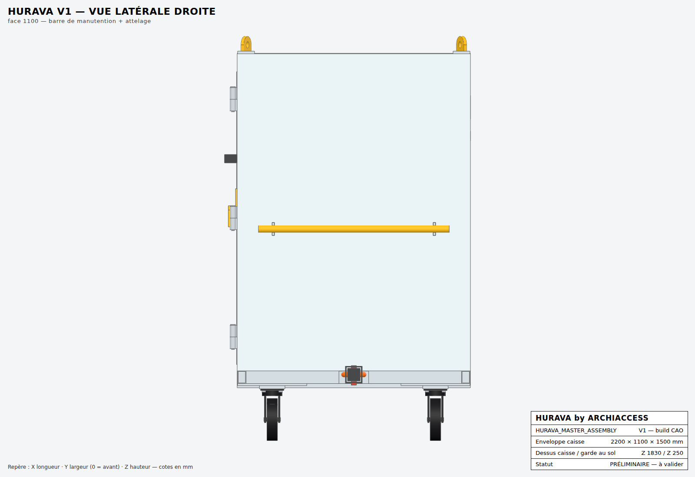

### Vue supérieure

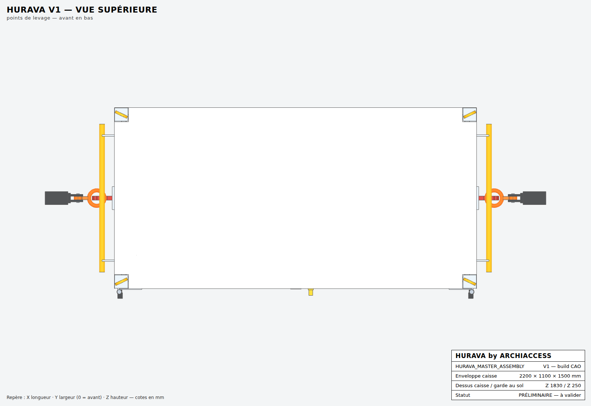

### Vue inférieure

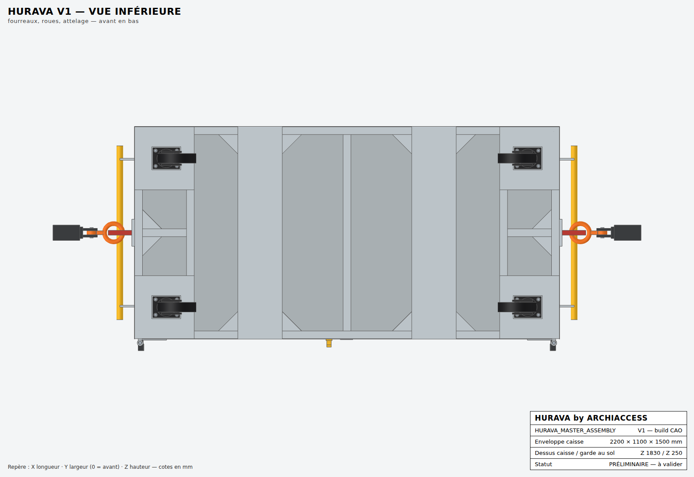

### Vue isométrique

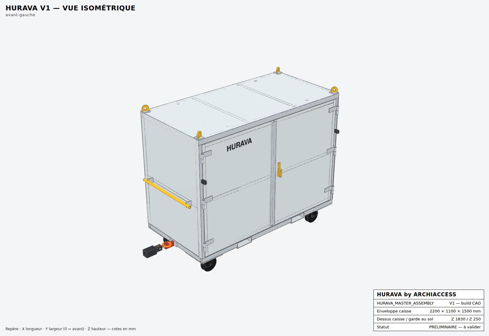

### Isométrique, portes à 90°

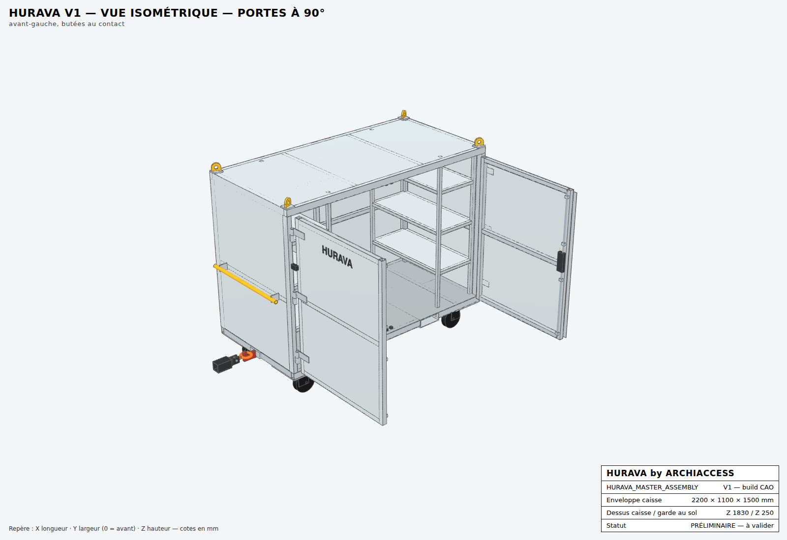

### Isométrique arrière-droite

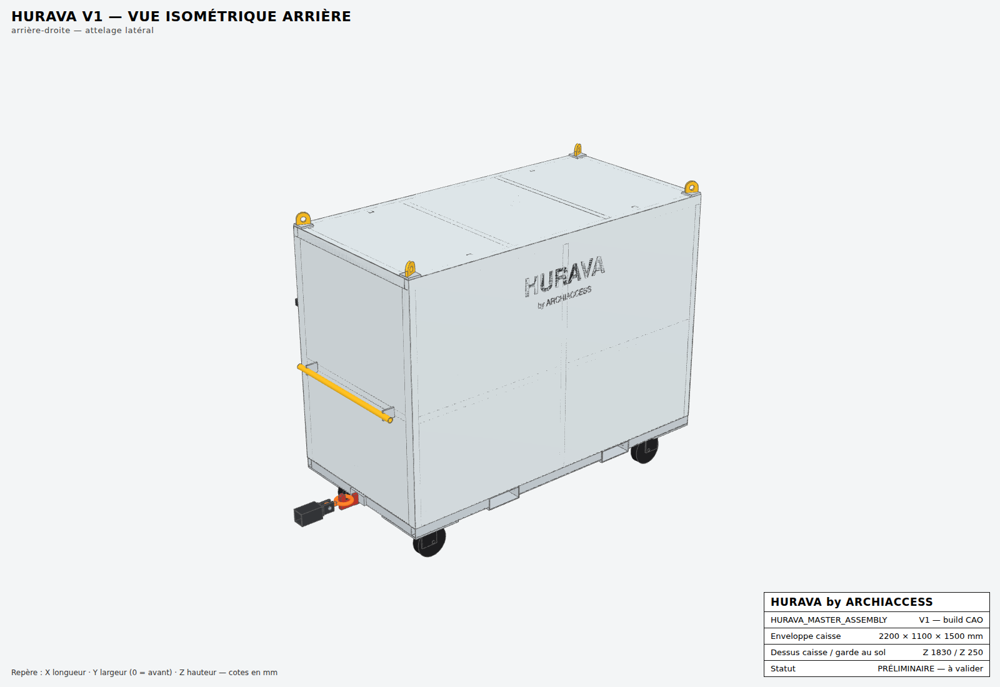

### Vue éclatée

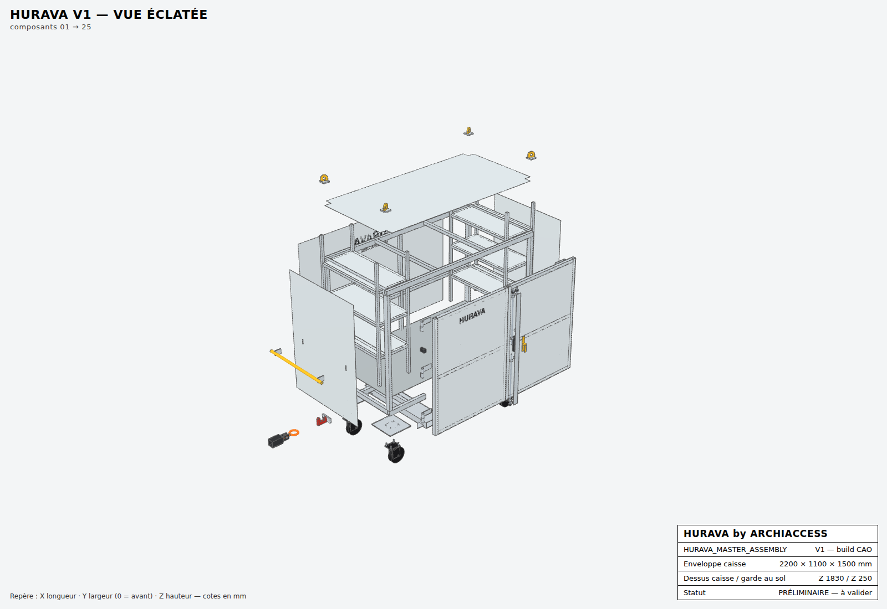

### Détail attelage latéral droit

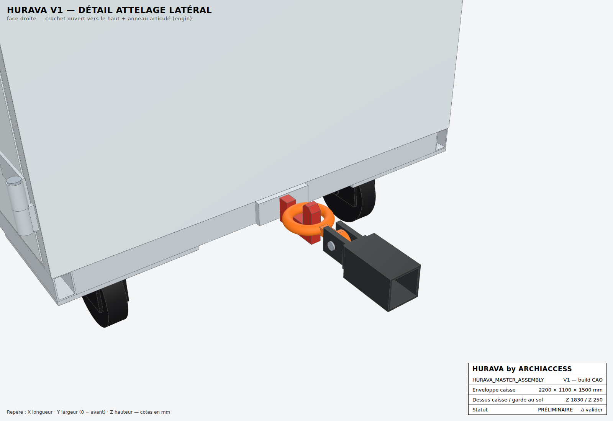

## 12. Nomenclature initiale

| Rep | Composant | Désignation | Section / référence | Longueur débit (mm) | Qté | Masse totale (kg) | Statut |
|---|---|---|---|---|---|---|---|
| 001 | 01_CHASSIS | Longeron AV tronçon 1 | Tube rect. 60×40×3 | 533 | 1 | 2.36 |  |
| 002 | 01_CHASSIS | Longeron AV tronçon 2 | Tube rect. 60×40×3 | 670 | 1 | 2.97 |  |
| 003 | 01_CHASSIS | Longeron AV tronçon 3 | Tube rect. 60×40×3 | 533 | 1 | 2.36 |  |
| 004 | 01_CHASSIS | Longeron AR tronçon 1 | Tube rect. 60×40×3 | 533 | 1 | 2.36 |  |
| 005 | 01_CHASSIS | Longeron AR tronçon 2 | Tube rect. 60×40×3 | 670 | 1 | 2.97 |  |
| 006 | 01_CHASSIS | Longeron AR tronçon 3 | Tube rect. 60×40×3 | 533 | 1 | 2.36 |  |
| 007 | 01_CHASSIS | Traverse de châssis d'extrémité | Tube rect. 60×40×3 | 1016 | 2 | 9.00 |  |
| 008 | 01_CHASSIS | Traverse de châssis intermédiaire | Tube rect. 60×40×3 | 1016 | 3 | 13.49 |  |
| 009 | 01_CHASSIS | Longeron d'attelage | Tube rect. 60×40×3 | 228 | 2 | 2.02 |  |
| 010 | 01_CHASSIS | Gousset d'angle de châssis | Gousset 100×100×5 |  | 4 | 0.78 |  |
| 011 | 01_CHASSIS | Montant d'angle | Tube rect. 60×40×3 | 1438 | 4 | 25.47 |  |
| 012 | 01_CHASSIS | Traverse haute avant | Tube rect. 60×40×3 | 2196 | 1 | 9.72 |  |
| 013 | 01_CHASSIS | Traverse haute arrière | Tube rect. 60×40×3 | 2196 | 1 | 9.72 |  |
| 014 | 01_CHASSIS | Traverse haute latérale | Tube rect. 60×40×3 | 1016 | 2 | 9.00 |  |
| 015 | 02_SECONDARY_STRUCTURE | Lisse latérale | Tube carré 40×40×3 | 976 | 2 | 6.80 |  |
| 016 | 02_SECONDARY_STRUCTURE | Montant arrière intermédiaire | Tube carré 40×40×3 | 1434 | 1 | 5.00 |  |
| 017 | 02_SECONDARY_STRUCTURE | Lisse arrière | Tube carré 40×40×3 | 1038 | 2 | 7.24 |  |
| 018 | 02_SECONDARY_STRUCTURE | Traverse de toit | Tube carré 40×40×3 | 1016 | 2 | 7.08 |  |
| 019 | 02_SECONDARY_STRUCTURE | Gousset de reprise d'attelage | Gousset 100×100×5 |  | 4 | 0.78 |  |
| 020 | 03_FLOOR | Plancher | Tôle ép. 4 |  | 1 | 75.27 | PROVISOIRE (ép. 4, larmée à valider) |
| 021 | 04_ROOF | Tôle de toit | Tôle ép. 2 |  | 1 | 37.53 | PROVISOIRE (ép.) |
| 022 | 05_SIDE_PANELS | Panneau latéral gauche | Tôle ép. 2 |  | 1 | 25.85 | PROVISOIRE (ép.) |
| 023 | 05_SIDE_PANELS | Panneau latéral droit | Tôle ép. 2 |  | 1 | 25.85 | PROVISOIRE (ép.) |
| 024 | 06_REAR_PANEL | Panneau arrière | Tôle ép. 2 |  | 1 | 51.65 | PROVISOIRE (ép.) |
| 025 | 07_FRONT_DOORS | Vantail G — Tôle de parement | Tôle ép. 2 |  | 1 | 23.46 |  |
| 026 | 07_FRONT_DOORS | Vantail G — Montant côté charnières | Tube carré 40×40×3 | 1423 | 1 | 4.96 |  |
| 027 | 07_FRONT_DOORS | Vantail G — Montant côté battement | Tube carré 40×40×3 | 1423 | 1 | 4.96 |  |
| 028 | 07_FRONT_DOORS | Vantail G — Traverse basse | Tube carré 40×40×3 | 970 | 1 | 3.38 |  |
| 029 | 07_FRONT_DOORS | Vantail G — Traverse haute | Tube carré 40×40×3 | 970 | 1 | 3.38 |  |
| 030 | 07_FRONT_DOORS | Vantail G — Traverse intermédiaire | Tube carré 40×40×3 | 970 | 1 | 3.38 |  |
| 031 | 08_DOOR_HINGES | Charnière — nœud fixe + patte | Nœud Ø30 + patte 20 |  | 6 | 1.67 |  |
| 032 | 08_DOOR_HINGES | Charnière — nœud mobile + penture | Nœud Ø30 + penture 6 |  | 6 | 3.36 |  |
| 033 | 08_DOOR_HINGES | Axe de charnière Ø16 | Ø16 × 118 | 118 | 6 | 1.18 | PROVISOIRE (matière) |
| 034 | 08_DOOR_HINGES | Butée d'ouverture 90° | Plat 40 découpé |  | 2 | 1.09 |  |
| 035 | 07_FRONT_DOORS | Vantail D — Tôle de parement | Tôle ép. 2 |  | 1 | 23.46 |  |
| 036 | 07_FRONT_DOORS | Vantail D — Montant côté charnières | Tube carré 40×40×3 | 1423 | 1 | 4.96 |  |
| 037 | 07_FRONT_DOORS | Vantail D — Montant côté battement | Tube carré 40×40×3 | 1423 | 1 | 4.96 |  |
| 038 | 07_FRONT_DOORS | Vantail D — Traverse basse | Tube carré 40×40×3 | 970 | 1 | 3.38 |  |
| 039 | 07_FRONT_DOORS | Vantail D — Traverse haute | Tube carré 40×40×3 | 970 | 1 | 3.38 |  |
| 040 | 07_FRONT_DOORS | Vantail D — Traverse intermédiaire | Tube carré 40×40×3 | 970 | 1 | 3.38 |  |
| 041 | 09_LOCKING_SYSTEM | Tringle haute Ø14 | Rond Ø14 | 676 | 1 | 0.82 |  |
| 042 | 09_LOCKING_SYSTEM | Tringle basse Ø14 | Rond Ø14 | 652 | 1 | 0.79 |  |
| 043 | 09_LOCKING_SYSTEM | Guide de tringle | Bloc 30×24 percé Ø15.5 |  | 8 | 0.67 |  |
| 044 | 09_LOCKING_SYSTEM | Gâche haute renforcée | Bloc 24 percé Ø16 |  | 2 | 0.18 |  |
| 045 | 09_LOCKING_SYSTEM | Gâche basse renforcée | Bloc 24 percé Ø16 |  | 2 | 0.13 |  |
| 046 | 09_LOCKING_SYSTEM | Tringle haute Ø14 | Rond Ø14 | 598 | 1 | 0.72 |  |
| 047 | 09_LOCKING_SYSTEM | Tringle basse Ø14 | Rond Ø14 | 670 | 1 | 0.81 |  |
| 048 | 09_LOCKING_SYSTEM | Boîtier de crémone-serrure | Crémone 3 points à cylindre |  | 1 | 2.20 | PROVISOIRE (référence) |
| 049 | 09_LOCKING_SYSTEM | Poignée palette extérieure cadenassable | Poignée palette + rosace |  | 1 | 1.10 | PROVISOIRE (référence) |
| 050 | 09_LOCKING_SYSTEM | Couvre-joint anti-pince / anti-arrachement | Plat 65×3 | 1383 | 1 | 2.12 |  |
| 051 | 10_RACK_LEFT | Montant de rack | Tube carré 30×30×2 | 1494 | 4 | 10.51 | PROVISOIRE (profondeur, cotes de niveaux) |
| 052 | 10_RACK_LEFT | Longeron de tablette | Tube carré 30×30×2 | 900 | 6 | 9.50 | PROVISOIRE (profondeur, cotes de niveaux) |
| 053 | 10_RACK_LEFT | Traverse de tablette | Tube carré 30×30×2 | 390 | 6 | 4.11 | PROVISOIRE (profondeur, cotes de niveaux) |
| 054 | 10_RACK_LEFT | Tablette tôle | Tôle ép. 2 |  | 3 | 20.17 | PROVISOIRE (profondeur, cotes de niveaux) |
| 055 | 11_RACK_RIGHT | Montant de rack | Tube carré 30×30×2 | 1494 | 4 | 10.51 | PROVISOIRE (profondeur, cotes de niveaux) |
| 056 | 11_RACK_RIGHT | Longeron de tablette | Tube carré 30×30×2 | 900 | 6 | 9.50 | PROVISOIRE (profondeur, cotes de niveaux) |
| 057 | 11_RACK_RIGHT | Traverse de tablette | Tube carré 30×30×2 | 390 | 6 | 4.11 | PROVISOIRE (profondeur, cotes de niveaux) |
| 058 | 11_RACK_RIGHT | Tablette tôle | Tôle ép. 2 |  | 3 | 20.17 | PROVISOIRE (profondeur, cotes de niveaux) |
| 059 | 13_WHEEL_SUPPORTS | Platine porte-roue | Tôle ép. 10 |  | 4 | 31.36 |  |
| 060 | 13_WHEEL_SUPPORTS | Cale de roulette | Plat ép. 15 |  | 4 | 8.23 | PROVISOIRE (dépend de la roulette retenue) |
| 061 | 12_WHEELS | Roulette pivotante Ø200 à frein total + blocage directionnel | Ø200×50 H245 CMU 500 kg |  | 2 | 19.00 | PROVISOIRE (référence catalogue) |
| 062 | 24_FASTENERS_HARDWARE | Vis H M12×50 cl. 8.8 + écrou frein + rondelle | M12×50 |  | 16 | 1.20 |  |
| 063 | 12_WHEELS | Roulette pivotante Ø200 à blocage directionnel | Ø200×50 H245 CMU 500 kg |  | 2 | 19.00 | PROVISOIRE (référence catalogue) |
| 064 | 14_HANDLING_BAR_LEFT | Barre de manutention | Tube rond Ø33.7×4.0 | 900 | 1 | 2.64 |  |
| 065 | 14_HANDLING_BAR_LEFT | Support de barre | Plat 60×10 | 77 | 2 | 0.66 |  |
| 066 | 15_HANDLING_BAR_RIGHT | Barre de manutention | Tube rond Ø33.7×4.0 | 900 | 1 | 2.64 |  |
| 067 | 15_HANDLING_BAR_RIGHT | Support de barre | Plat 60×10 | 77 | 2 | 0.66 |  |
| 068 | 16_FORK_POCKET_LEFT | Fourreau de fourches | Tube rect. 230×80×5 | 1100 | 1 | 25.90 | PROVISOIRE (section, entraxe) |
| 069 | 16_FORK_POCKET_LEFT | Gousset fourreau / longeron | Gousset 100×100×5 |  | 4 | 0.78 |  |
| 070 | 17_FORK_POCKET_RIGHT | Fourreau de fourches | Tube rect. 230×80×5 | 1100 | 1 | 25.90 | PROVISOIRE (section, entraxe) |
| 071 | 17_FORK_POCKET_RIGHT | Gousset fourreau / longeron | Gousset 100×100×5 |  | 4 | 0.78 |  |
| 072 | 18_LIFTING_POINT_FL | Platine d'oreille de levage | Plat 80×80×12 |  | 1 | 0.60 |  |
| 073 | 18_LIFTING_POINT_FL | Oreille de levage | Tôle ép. 15 oxycoupée |  | 1 | 0.48 | PROVISOIRE (CMU à calculer) |
| 074 | 19_LIFTING_POINT_FR | Platine d'oreille de levage | Plat 80×80×12 |  | 1 | 0.60 |  |
| 075 | 19_LIFTING_POINT_FR | Oreille de levage | Tôle ép. 15 oxycoupée |  | 1 | 0.48 | PROVISOIRE (CMU à calculer) |
| 076 | 20_LIFTING_POINT_RL | Platine d'oreille de levage | Plat 80×80×12 |  | 1 | 0.60 |  |
| 077 | 20_LIFTING_POINT_RL | Oreille de levage | Tôle ép. 15 oxycoupée |  | 1 | 0.48 | PROVISOIRE (CMU à calculer) |
| 078 | 21_LIFTING_POINT_RR | Platine d'oreille de levage | Plat 80×80×12 |  | 1 | 0.60 |  |
| 079 | 21_LIFTING_POINT_RR | Oreille de levage | Tôle ép. 15 oxycoupée |  | 1 | 0.48 | PROVISOIRE (CMU à calculer) |
| 080 | 22_HITCH_HOOK | Platine d'attelage | Plat 140×59×15 |  | 2 | 1.95 |  |
| 081 | 22_HITCH_HOOK | Crochet d'attelage ouvert vers le haut (sans ressort) | Tôle ép. 25 oxycoupée |  | 2 | 2.77 | PROVISOIRE (nuance S355 ou pièce forgée à étudier, hauteur d'attelage) |
| 082 | 25_LOGO | Marquage HURAVA by ARCHIACCESS — face arrière | Film adhésif découpé |  | 1 | 0.05 |  |
| 083 | 25_LOGO | Marquage HURAVA — vantail gauche | Film adhésif découpé |  | 1 | 0.02 |  |
